<div align="center">

# 🛡️ Sentinel

### Production-grade fraud detection. Real-time scoring. Explainable decisions.

A full-stack fraud operations platform that scores transactions in **8.5ms**, explains every decision with **SHAP attributions**, and surfaces **$1.23M in modeled net savings** through cost-aware threshold tuning. Built end-to-end as a single engineer: calibrated machine learning pipeline, multi-tenant FastAPI backend, and a real-time React workspace for fraud analysts.

[](https://www.python.org/)
[](https://fastapi.tiangolo.com/)
[](https://react.dev/)
[](https://www.typescriptlang.org/)
[](https://www.postgresql.org/)
[](https://lightgbm.readthedocs.io/)
[](https://shap.readthedocs.io/)
[](LICENSE)

**Live Demo:** [sentinel.robertjeanpierre.com](https://sentinel.robertjeanpierre.com) *(coming soon)*  ·  **Portfolio:** [robertjeanpierre.com](https://robertjeanpierre.com)

</div>

---

## At a Glance

| Metric | Value |
|--------|-------|
| **Test PR-AUC** | **0.992** on hidden test set, never used for selection |
| **Recall at production threshold** | **99.5%** fraud detection |
| ⚡ **Single-prediction latency** | **8.5ms** including SHAP attribution |
| **Modeled net savings** | **$1.23M** at cost-optimized threshold |
| **Training dataset** | **6.36M** transactions from PaySim |
| **REST API endpoints** | **50+** across 14 router modules |
| **Database tables** | **13** with multi-tenant isolation |
| **Tests passing** | **40** across backend and ML |
| **Frontend pages** | **14** with full mobile responsive design |

---

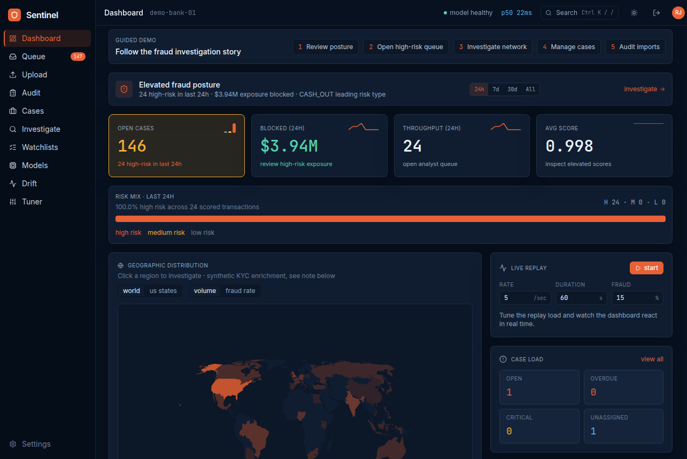

> The Sentinel fraud operations dashboard. Real-time KPIs, geographic risk distribution, a live replay engine streaming synthetic transactions through the model, and SLA-aware case management — all rendered from a Postgres-backed multi-tenant API.

---

## Why I Built This

Fraud detection sits at the exact intersection I want to work in: **systems engineering that ships machine learning to users who depend on it.** It is one of the hardest applied ML problems in production because three forces are in constant tension:

- **Recall vs. precision.** Catching more fraud means more false positives, which floods analysts and erodes trust.
- **Latency vs. interpretability.** Real-time decisions demand fast inference, but every flagged transaction needs an explanation a human can defend.
- **Offline performance vs. production reality.** Models that look perfect in notebooks fail the moment distribution drift hits.

I built Sentinel to demonstrate that I can hold all three in tension and ship a product that respects each one. Calibrated probabilities so threshold tuning is meaningful. SHAP attributions on every prediction so analysts can defend decisions. Drift monitoring so the system can warn itself when reality stops matching training. A real interface for the humans who use it, not just a notebook output.

This is the kind of system I want to build for a living.

---

## Product Tour

### Fraud Operations Command Center
The analyst's home base. Animated KPI cards, a live posture banner that surfaces elevated risk windows, risk mix bar, geographic distribution mapped from synthetic KYC enrichment, and a replay engine that streams synthetic transactions through the model in real time so the dashboard breathes with live data.

| Dark Mode | Light Mode |
|-----------|------------|
|  | 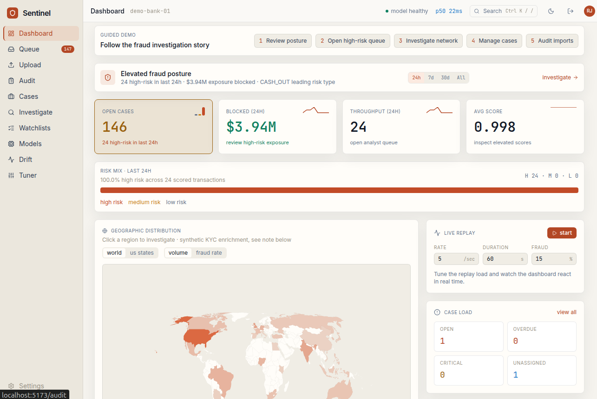 |

### Login & Brand Surface
Split-screen entry with a fraud command center preview. Demo credentials are visible on the login card so recruiters can sign in without setup friction.

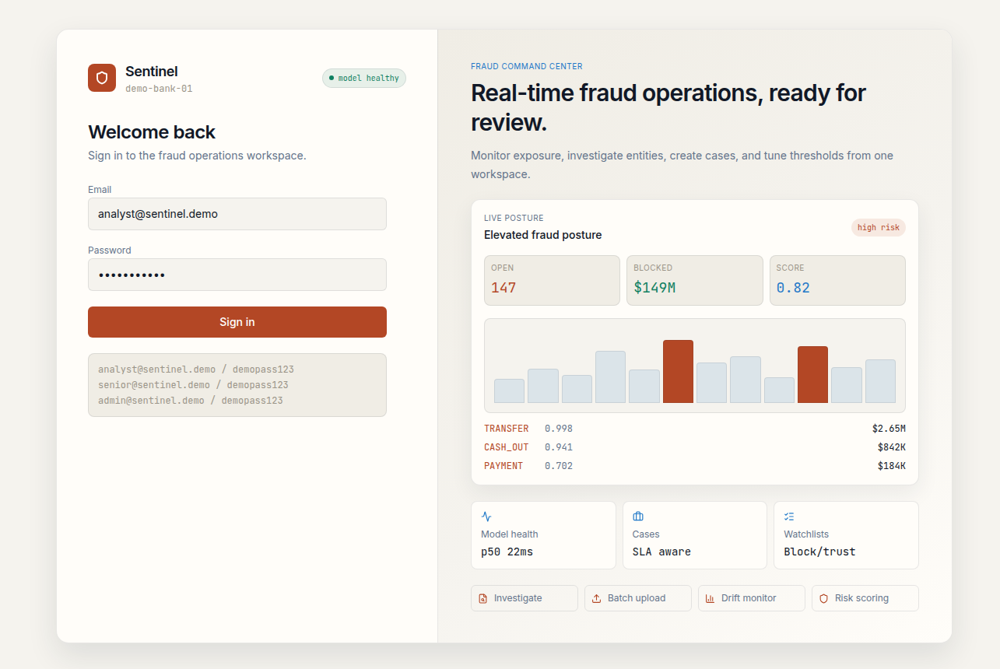

### Fraud Queue
The analyst worklist. Risk and decision filters, paginated, with real-time polling so newly scored transactions surface without a refresh.

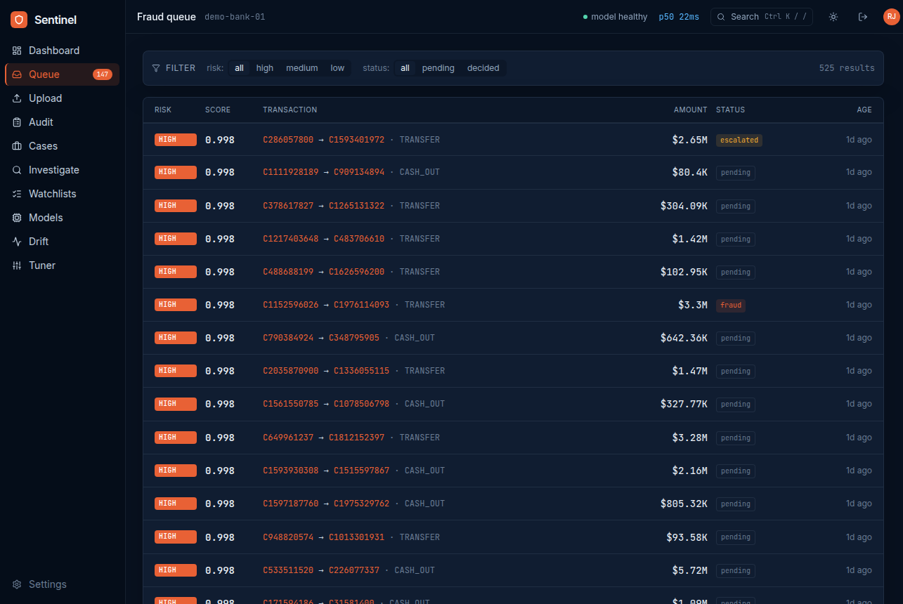

### Transaction Detail with SHAP Explainability
Every prediction comes with reasoning. The SHAP waterfall shows the top contributing features, and a plain-English analyst summary translates the math into language a fraud analyst can defend in a meeting. Decision buttons (`confirmed_fraud`, `false_positive`, `escalated`) record analyst feedback for future model retraining.

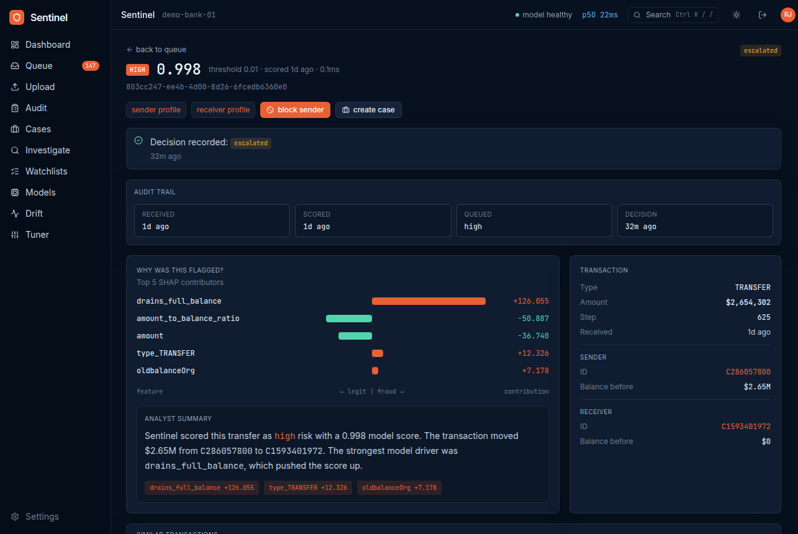

### Entity Profile
Account-level investigation. Counterparty network, risk trend, full transaction history, watchlist controls. Account IDs across the entire app deep-link to this view.

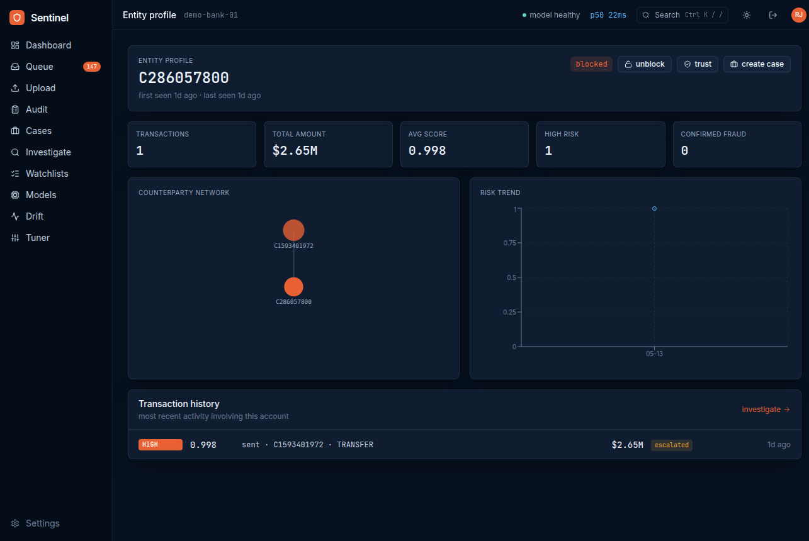

### Multi-Criteria Investigation
Full-history search with stats strip, quick-select presets, bulk action bar, CSV export, and URL-synced filters for deep-linking.

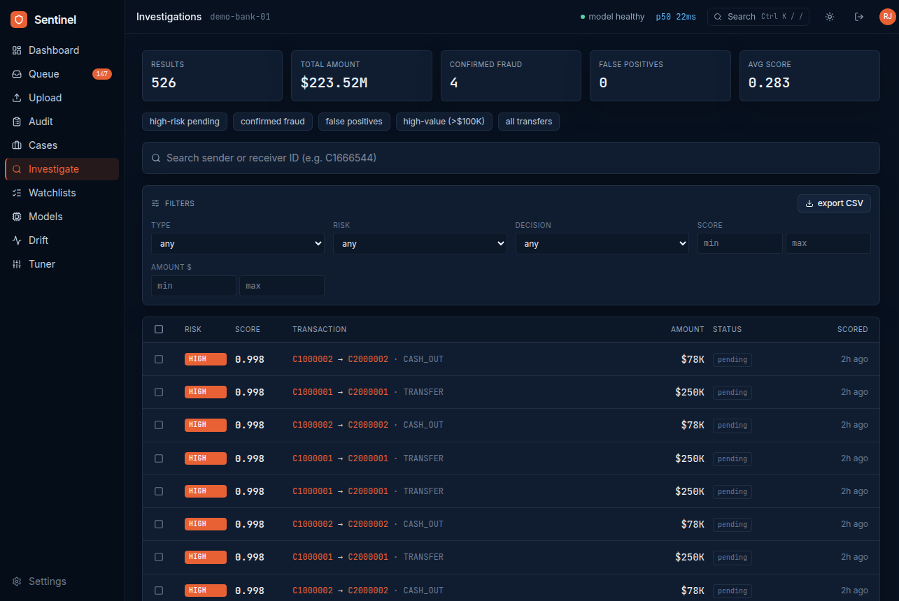

### Case Management with SLA Tracking
Cases bundle transactions, entities, and notes under a single investigation. Created from the queue, entity profile, or the investigate bulk action.

| Cases List | Case Detail |
|------------|-------------|
| 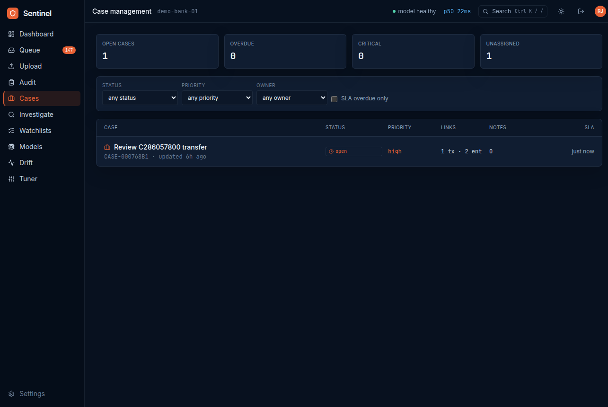 | 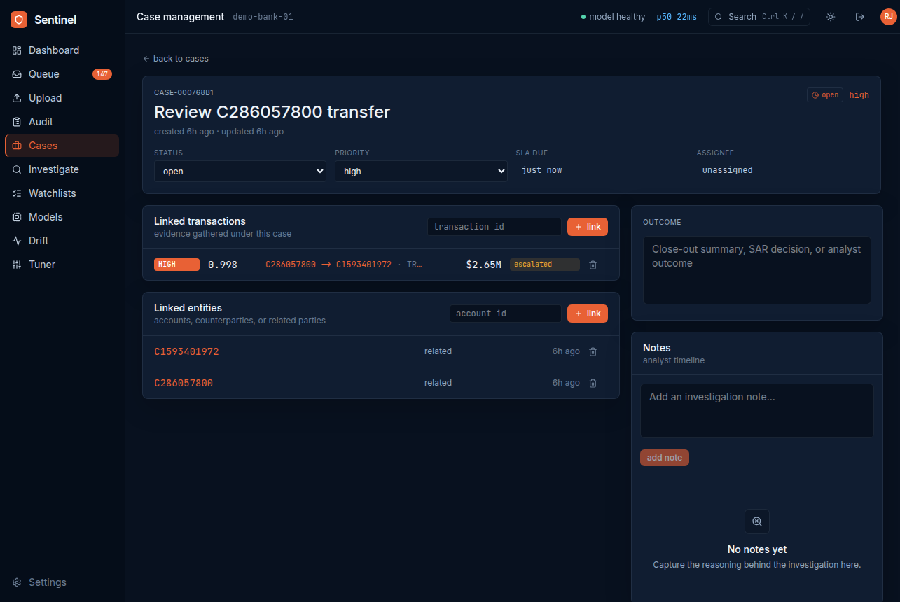 |

### MLOps: Drift Monitoring & Cost-Aware Threshold Tuning
Per-feature PSI tracking with baseline-vs-recent score distribution comparison. A threshold tuner that visualizes precision, recall, and **net business savings** against a configurable cost model — not just abstract ROC curves.

| Drift Monitoring | Threshold Tuner |
|------------------|-----------------|
| 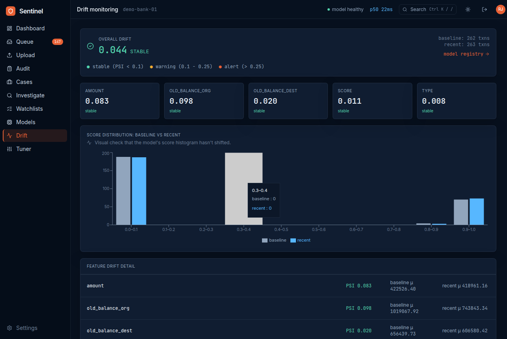 | 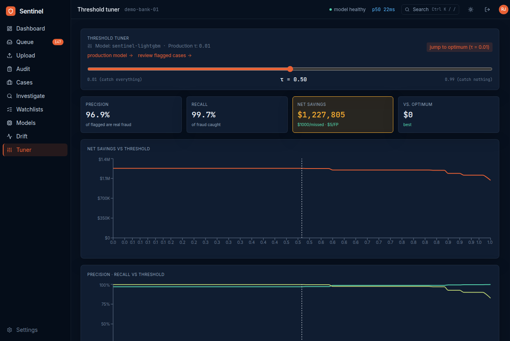 |

### Hardened Batch Upload with Audit Trail
CSV ingestion pipeline hardened against six attack classes. Schema validation, 5 MB cap, per-user rate limiting, formula injection neutralization, role-based access, and a full audit panel.

| Upload | Audit |
|--------|-------|
| 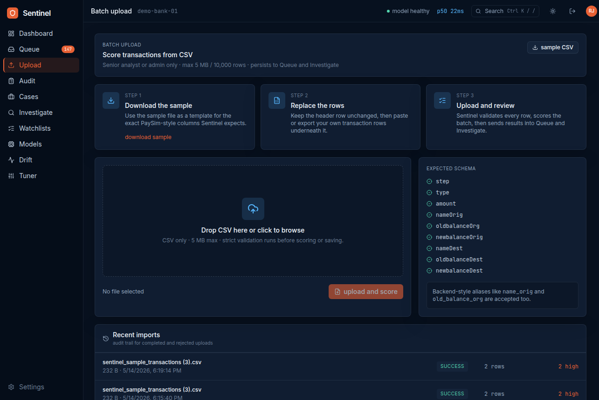 | 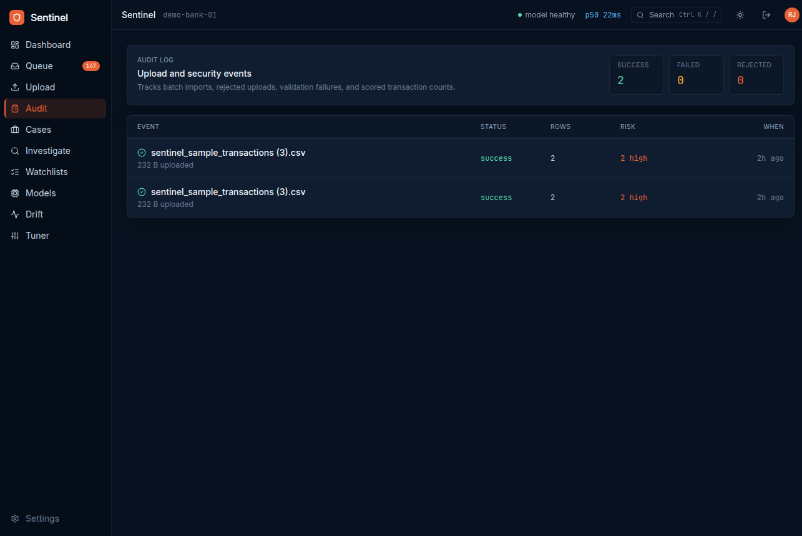 |

### Responsive Design
Every page adapts from desktop to phone with off-canvas drawer navigation. Tables become horizontal scroll regions instead of squishing the layout.

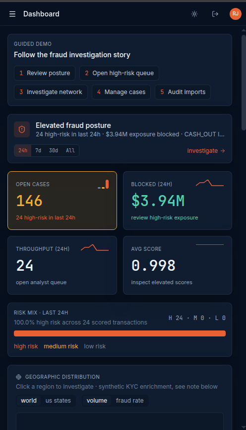

### Model Registry & Admin Settings
Versioned model registry with stage badges and live test metrics. Admin-gated threshold control on the settings page alongside profile, tenant, and alert rule configuration.

| Model Registry | Settings |
|----------------|----------|
| 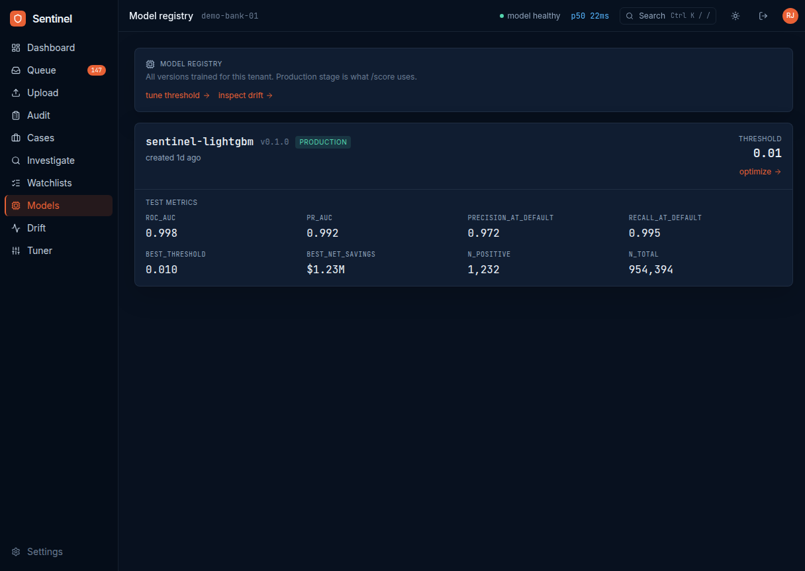 | 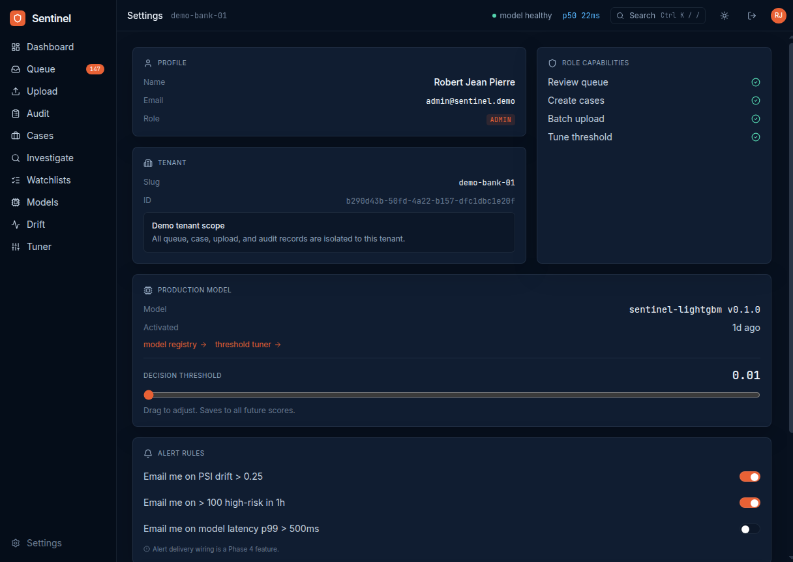 |

---

## System Architecture

Sentinel is built around a clean separation between the offline ML pipeline, an in-process scoring service, and a real-time React workspace. Postgres is the single source of truth for tenants, transactions, predictions, cases, and audit events. The model is loaded once at API startup and served in-process for sub-10ms scoring latency.

```
┌─────────────────────────────────────────────────────────┐
│                      Client Layer                       │
│            Desktop  /  Tablet  /  Mobile                │
│      (React 19 + TypeScript + Tailwind + Vite)          │
└────────────────┬────────────────────┬───────────────────┘
                 │                    │
                 ▼                    ▼
┌────────────────────────┐  ┌────────────────────────┐
│   Analyst Workspace    │  │     Admin Surface      │
│   /dashboard           │  │   /models              │
│   /queue               │  │   /tuner               │
│   /transactions/:id    │  │   /drift               │
│   /entities/:id        │  │   /settings            │
│   /investigate         │  │   /audit               │
│   /cases               │  │                        │
│   /upload              │  │                        │
└───────────┬────────────┘  └───────────┬────────────┘
            │                           │
            └─────────────┬─────────────┘
                          ▼
┌─────────────────────────────────────────────────────────┐
│                  Authentication Layer                   │
│   JWT bearer tokens (PyJWT + passlib bcrypt)            │
│   Role-based dependencies: analyst, senior, admin       │
│   Multi-tenant isolation via tenant_id on every row     │
└────────────────────────┬────────────────────────────────┘
                         │
                         ▼
┌─────────────────────────────────────────────────────────┐
│              FastAPI Router Layer                       │
│  ┌─────────┐ ┌─────────┐ ┌─────────┐ ┌──────────┐       │
│  │ scoring │ │  queue  │ │  cases  │ │investigate│      │
│  └─────────┘ └─────────┘ └─────────┘ └──────────┘       │
│  ┌─────────┐ ┌─────────┐ ┌─────────┐ ┌──────────┐       │
│  │dashboard│ │ entities│ │ upload  │ │  replay  │       │
│  └─────────┘ └─────────┘ └─────────┘ └──────────┘       │
│  ┌─────────┐ ┌─────────┐ ┌─────────┐ ┌──────────┐       │
│  │  drift  │ │  tuner  │ │ models  │ │watchlists│       │
│  └─────────┘ └─────────┘ └─────────┘ └──────────┘       │
└──────────┬──────────────────────────┬───────────────────┘
           │                          │
           ▼                          ▼
┌──────────────────────┐  ┌──────────────────────────┐
│   PostgreSQL 16      │  │   ML Service (in-proc)   │
│                      │  │                          │
│  13 relational       │  │   LightGBM (calibrated)  │
│  tables with         │  │   SHAP TreeExplainer     │
│  multi-tenant        │  │   8.5ms per prediction   │
│  soft delete and     │  │                          │
│  JSONB for SHAP      │  │   MLflow tracking        │
│  explanations        │  │   DVC for data version   │
└──────────────────────┘  └──────────────────────────┘
```

**Why this architecture:**

- **In-process model serving** avoids a network hop on the hot path. The model loads once at startup and serves every `/score` request with the same explainer instance. Latency budget: 8.5ms p50.
- **Multi-tenant by construction.** Every domain table carries `tenant_id`. Cross-tenant access is impossible at the query level, not just the application layer.
- **JSONB for evolving payloads.** SHAP explanations, model metrics, and upload risk distributions all live in JSONB columns. The schema evolves without migration churn.
- **DVC for data, Git for code.** The 471 MB PaySim CSV is versioned via DVC alongside the model artifact. Anyone cloning the repo can `dvc pull` and reproduce the exact training data.

---

## Database Design

The schema is built around multi-tenant isolation, soft deletes, and JSONB for flexible payloads. Every row that could leak across tenants carries a `tenant_id`.

```sql
-- Tenancy & identity
tenants            (id, slug UNIQUE, name, created_at)
users              (id, tenant_id FK, email UNIQUE, password_hash, role, created_at)
                   -- role: 'analyst' | 'senior_analyst' | 'admin'

-- Model lifecycle
model_versions     (id, tenant_id FK, name, version, stage, metrics JSONB,
                    threshold, artifact_path, created_at)
                   -- stage: 'production' | 'staging' | 'archived'

-- Scoring & feedback
transactions       (id, tenant_id FK, external_id, step, type, amount,
                    name_orig, old_balance_org, new_balance_org,
                    name_dest, old_balance_dest, new_balance_dest,
                    is_fraud, created_at)
predictions        (id, tenant_id FK, transaction_id FK, model_version_id FK,
                    score, risk_band, explanation JSONB, latency_ms,
                    threshold_at_score, created_at)
analyst_decisions  (id, tenant_id FK, transaction_id FK, user_id FK,
                    decision, rationale, created_at)
                   -- decision: 'confirmed_fraud' | 'false_positive' | 'escalated'

-- Investigation workflow
cases              (id, tenant_id FK, title, description, status, priority,
                    assigned_to FK, sla_due_at, created_by FK,
                    closed_at, outcome, created_at, updated_at)
case_transactions  (case_id FK, transaction_id FK, added_at)
case_entities      (case_id FK, account_id, role, added_at)
case_notes         (id, case_id FK, user_id FK, content, created_at)

-- Watchlists & geographic enrichment
watchlist_entries  (id, tenant_id FK, account_id, list_type, reason, created_at)
                   -- list_type: 'blocked' | 'trusted'
account_geo        (account_id PK, country, country_name, region, city, lat, lon)

-- MLOps & security
drift_snapshots    (id, tenant_id FK, feature_name, psi, baseline_mean,
                    recent_mean, captured_at)
upload_audits      (id, tenant_id FK, user_id FK, filename, file_size,
                    status, rows_total, rows_scored, risk_counts JSONB,
                    error JSONB, created_at)
```

**Key design decisions:**
- `tenant_id` on every domain row enforces isolation at the query level, not the application layer
- JSONB columns for `explanation`, `metrics`, and `risk_counts` let the schema evolve without migrations for payload shape changes
- String columns over Postgres `ENUM` types for status fields make migrations cleaner (adding a new status doesn't require a schema change)
- Soft delete via `deleted_at` preserves audit history when records leave the UI
- Composite primary keys on join tables (`case_transactions`, `case_entities`) prevent duplicate links

---

## Machine Learning Deep Dive

### The Problem
Fraud detection at scale has three tensions in conflict. Models that maximize accuracy miss the rare fraud cases. Models that maximize fraud recall flood analysts with false positives. And models that look great on validation data often fail in production due to distribution drift or label leakage that wasn't caught during training.

### The Approach
I built a calibrated LightGBM classifier with strict leakage controls, isotonic probability calibration, and SHAP-based explainability on every prediction.

**Why LightGBM?**
- Handles class imbalance natively via `scale_pos_weight` (fraud is roughly 0.13% of transactions)
- Trains fast enough for iterative experimentation across hundreds of hyperparameter combinations
- Pairs with SHAP TreeExplainer for fast, exact attributions on every prediction
- Outperformed XGBoost and Logistic Regression baselines on PR-AUC across multiple ablations

### Dataset
**PaySim** — 6.36M synthetic mobile money transactions with a ~0.13% fraud rate. Tracked via DVC so the exact training data is reproducible from a clone.

| Feature | Source | Description |
|---------|--------|-------------|
| `amount` | raw | Transaction amount |
| `type_TRANSFER`, `type_CASH_OUT`, etc. | one-hot | Transaction type indicators |
| `old_balance_org` | raw | Sender balance before transaction |
| `new_balance_org` | raw | Sender balance after transaction |
| `old_balance_dest` | raw | Receiver balance before transaction |
| `new_balance_dest` | raw | Receiver balance after transaction |
| `amount_to_balance_ratio` | engineered | Amount relative to sender balance |
| `drains_full_balance` | engineered | Flag for transactions that empty the sender account |
| `hour`, `day` | engineered | Temporal patterns derived from the `step` column |

Total: 16 features after one-hot encoding.

### Results

Final evaluation on the hidden test set, which was never used for model selection:

| Metric | Value | Notes |
|--------|-------|-------|
| **Test PR-AUC** | **0.992** | PaySim signal is clean; real-world is usually 0.3 to 0.7 |
| **Test ROC-AUC** | 0.999 | Less informative than PR-AUC for rare-event problems |
| **Validation PR-AUC** | 0.993 | 0.001 gap from test = no overfitting |
| **Precision at default τ** | 0.972 | At threshold τ=0.01 |
| **Recall at default τ** | **0.995** | |
| **Net savings** | **$1.23M** | At τ=0.01 with cost model $1000/missed fraud, $5/false positive |
| **Latency** | **8.5ms** | Single prediction including SHAP attribution |

**Top SHAP features by global importance:**

| Feature | Interpretation |
|---------|----------------|
| `oldbalanceDest` | Receiver's balance before the transaction (laundering accounts often start at zero) |
| `amount_to_balance_ratio` | Transactions that move most of the sender's balance |
| `amount` | Raw transaction size |
| `drains_full_balance` | Engineered flag for cash-out patterns |
| `day`, `hour` | Temporal patterns (fraud spikes at specific times) |

### The Hard Engineering Decisions

**1. Stratified random split, not temporal split.** PaySim's `step` column looks like a time index, but the simulator generates non-uniform fraud distribution. Fraud rate jumps 10x in the last 40% of the timeline. A naive temporal split caused validation PR-AUC to collapse below 0.01. The decision was documented in `docs/model_card.md` as a defensible portfolio-grade tradeoff — true temporal honesty is deferred to the production drift monitoring system.

**2. Dropped sender/receiver aggregate features.** The first version included `sender_avg_amount` and `sender_txn_count`. Ablation proved these were not necessary — PR-AUC went from 0.971 (with aggregates) to 0.993 (without). The simpler model won, and the ablation itself serves as the leakage-free proof.

**3. Hidden test set discipline.** The test set was never loaded during training or hyperparameter search. It was revealed exactly once in `scripts/final_eval.py` to produce the locked metrics in `models/lightgbm_final_test_report.json`.

**4. Isotonic calibration via FrozenEstimator.** Raw LightGBM probabilities are not well-calibrated, which matters when threshold tuning is driven by an explicit cost model. I wrapped the trained model in `CalibratedClassifierCV` with isotonic regression so that a score of 0.8 actually corresponds to roughly an 80% fraud probability.

### Production Integration

The model is loaded into the FastAPI process at startup via a `lifespan` context manager. Every `/score` request goes through:

1. **API receives** the transaction payload via JWT-authenticated POST
2. **Validation layer** runs Pydantic schema checks
3. **Feature engineering** applies the same transforms used in training (`prepare()` pipeline)
4. **Model inference** runs LightGBM `predict_proba` followed by isotonic calibration
5. **SHAP TreeExplainer** computes per-feature attributions
6. **Persistence** writes the prediction, score, risk band, and explanation JSONB to Postgres
7. **Response** returns score, risk band, top 5 SHAP features, and latency — typically in 8ms

This in-process approach avoids the network overhead of a separate model service while keeping the model swappable through the registry — `/models/{id}` controls which version is in production for each tenant.

### Future ML Enhancements
- Train on real anonymized banking data for production-grade performance
- Add graph features (transaction velocity per account, counterparty centrality)
- Implement online retraining triggered by drift alerts
- Add a champion-challenger framework for live A/B testing of model versions
- Explore deep tabular models (TabNet, FT-Transformer) for benchmarking

---

## Security Implementation

### Authentication Flow
1. User submits credentials at `/auth/login`
2. `passlib` verifies the submitted password against the bcrypt hash in `users.password_hash`
3. On success, a JWT is signed with the user ID, tenant ID, and role
4. The frontend stores the token in `localStorage` and attaches it as `Authorization: Bearer <token>` on every request
5. FastAPI dependencies (`get_current_user`, `require_role`) decode the JWT, fetch the user, and reject requests with invalid or expired tokens
6. Multi-tenant isolation is enforced by adding `WHERE tenant_id = :tenant_id` to every query, derived from the authenticated user's JWT claims

### CSV Upload Hardening
The batch upload pipeline was hardened iteratively against multiple attack classes:

- **File size cap.** 5 MB enforced at the API layer before any parsing happens, preventing memory exhaustion attacks
- **Row count cap.** 10,000 row maximum, rejected before scoring begins
- **MIME and extension validation.** Only `.csv` files with `text/csv` content type are accepted
- **UTF-8 enforcement.** Files that fail UTF-8 decoding are rejected, blocking binary payload attempts
- **Formula injection neutralization.** Cells starting with `=`, `+`, `-`, or `@` are escaped before storage, preventing CSV injection attacks when exports are opened in Excel
- **Null byte stripping.** Text fields have null bytes removed before persistence
- **Role-based gating.** Only `senior_analyst` and `admin` roles can upload, surfaced as a disabled state for regular analysts
- **Per-user rate limiting.** 3 uploads per minute, 20 per hour, enforced in-memory (production deployment would use Redis for cross-worker consistency)
- **Audit trail.** Every upload attempt creates a row in `upload_audits` with filename, file size, status, row counts, risk distribution, and any validation errors
- **Reverse-proxy body limit.** Nginx `client_max_body_size 5M` directive in `infra/nginx/upload_limits.conf` enforces the cap at the edge

### Row-Level Validation
Instead of failing the whole batch on the first bad row, the upload pipeline collects per-row validation errors and surfaces them in the UI. The user sees exactly which rows failed and why, without losing the rows that were valid.

---

## Challenges & Solutions

### 1. The PaySim Temporal Split Collapse
**Challenge:** My first model trained perfectly on validation, but PR-AUC dropped below 0.01 the moment I switched to a temporal split. The dataset's `step` column looked like a time index, so a temporal split felt like the honest choice.

**Solution:** I investigated fraud distribution by `step` and discovered PaySim's simulator generates highly non-uniform fraud rates. The last 40% of the timeline contains roughly 10x the fraud density of the first 60%. A temporal split was effectively asking the model to learn one distribution and predict on a different one. I switched to stratified random split, documented the decision in the model card, and noted that true temporal honesty belongs in the production drift monitoring system — not the offline split.

**What I learned:** Best-practice splits are dataset-dependent. The honest choice is the one that yields a model that generalizes within assumptions you can defend, plus a drift system that catches when those assumptions break in production. This is exactly how production ML teams handle the gap between offline and online performance.

### 2. Cross-Tenant Data Leakage Prevention
**Challenge:** Multi-tenant systems fail in two ways. Either the schema doesn't isolate tenants and a bug exposes one tenant's data to another, or the schema isolates tenants but query code forgets to filter. Both fail silently and catastrophically.

**Solution:** I made `tenant_id` a required column on every domain table, enforced it at the FastAPI dependency layer with a `get_tenant_context` helper that pulls tenant from the JWT and gets injected into every router, and wrote integration tests that explicitly attempt cross-tenant access to confirm 404 responses.

**What I learned:** Multi-tenancy is a discipline, not a feature. The hard part isn't adding the column — it's making sure every single query references it. Centralizing access through dependency injection is what makes the discipline sustainable across 50+ endpoints.

### 3. SHAP Latency Budget
**Challenge:** Raw LightGBM scoring is sub-millisecond, but SHAP TreeExplainer attribution added enough overhead to push p99 latency past 50ms on early iterations. For a fraud system meant to score transactions in real time, that's a problem.

**Solution:** I profiled the bottleneck with `cProfile` and found that creating the explainer per-request was the culprit. I moved the `TreeExplainer` initialization into the API `lifespan` startup, kept it as a module-level singleton, and reused it across all requests. Final latency landed at **8.5ms p50** including SHAP, with the explainer creation cost amortized across the lifetime of the process.

**What I learned:** ML serving performance is mostly about where you put the work. The model loads once, the explainer loads once, and per-request code does only the math that actually depends on the input. This is the same pattern used by every production ML inference server I've studied.

### 4. Calibration Without Sacrificing Threshold Tuning
**Challenge:** Raw gradient-boosted probabilities don't reflect actual fraud rates — a score of 0.9 might mean 60% probability or 99% probability depending on the model. This makes cost-based threshold tuning meaningless because the cost model assumes calibrated probabilities.

**Solution:** I wrapped the trained LightGBM model in `CalibratedClassifierCV` with isotonic regression, using sklearn 1.8's `FrozenEstimator` API to calibrate without retraining the base model. Validated calibration with reliability diagrams, and the threshold tuner now operates on probabilities that have empirical meaning.

**What I learned:** Calibration is the bridge between "the model says 0.9" and "we should expect 90% of these to be fraud." Without it, every downstream decision driven by the score — thresholds, queue prioritization, case escalation rules — is built on sand.

### 5. Theme System Without Hard-Coded Colors
**Challenge:** The initial styling had hard-coded `rgba(...)` values scattered across 14 page files. Adding light mode meant either duplicating every page's styles or refactoring the entire system.

**Solution:** Built a CSS custom property system with semantic tokens (`--color-surface`, `--color-surface-raised`, `--color-grid`, `--color-success-soft`, etc.). Each token has dark and light values defined once in `index.css`. Every component reads from tokens, not raw colors. Adding a third theme would require editing one file.

**What I learned:** Design systems live or die on whether the abstractions are semantic. `--color-surface-raised` survives any redesign. `--color-gray-700` doesn't. This is exactly the pattern used by GitHub's Primer and Stripe's design system.

### 6. CSV Upload Attack Surface
**Challenge:** A "drag and drop a CSV" feature looks innocuous, but it's actually one of the highest-risk surfaces in a fraud detection product. Six categories of attack are realistic: memory exhaustion via massive files, formula injection on Excel export, binary payload smuggling via non-UTF-8 bytes, unauthorized batch scoring abuse, duplicate-data corruption, and rate-limit-bypass denial of service.

**Solution:** Hardened the pipeline in layers — a 5 MB body cap at the Nginx edge, 5 MB API-level cap, 10K row cap, strict MIME/extension validation, UTF-8 decode enforcement, formula injection neutralization (`=`, `+`, `-`, `@` prefix escaping), null byte stripping, role-based access gating (only senior analysts and admins), per-user rate limiting (3/min, 20/hour), and an audit table tracking every attempt. Built a "Recent imports" UI panel so the audit trail is visible to operators.

**What I learned:** Security at scale is a defense-in-depth game. No single control is sufficient. The discipline is to think like an attacker for every new ingress surface and add controls in layers so that a single missed check doesn't end the system.

---

## Tech Stack

| Layer | Technology | Purpose |
|-------|-----------|---------|
| **Backend** | Python 3.12, FastAPI | Async API server with auto-generated OpenAPI docs |
| **Package Manager** | uv | Faster than pip+venv, reproducible installs |
| **Database** | PostgreSQL 16 | Relational store with JSONB and multi-tenant isolation |
| **ORM** | SQLAlchemy 2.0 | Type-safe queries with async support |
| **Migrations** | Alembic | Versioned schema changes |
| **Validation** | Pydantic v2 | Request/response schemas with strict typing |
| **Auth** | PyJWT, passlib (bcrypt) | JWT tokens with role-based access |
| **ML Model** | LightGBM | Gradient-boosted decision trees with calibration |
| **Explainability** | SHAP TreeExplainer | Per-prediction feature attribution |
| **Experiment Tracking** | MLflow | Runs, params, metrics, artifacts |
| **Data Versioning** | DVC | PaySim CSV tracked alongside code |
| **Frontend Runtime** | Node 22, pnpm 11 | Modern JS toolchain |
| **Build Tool** | Vite 8 | Fast HMR, optimized production builds |
| **Framework** | React 19, TypeScript 6 | Type-safe UI with concurrent rendering |
| **Styling** | Tailwind v4 | Utility-first CSS with semantic theme tokens |
| **Routing** | React Router v7 | URL-synced filter state for deep-linking |
| **Data Fetching** | TanStack Query 5 | Cache management with polling and invalidation |
| **State** | Zustand 5 | Lightweight global state for auth, theme, toasts |
| **Charts** | Recharts | Area, bar, line charts with gradients |
| **Maps** | react-simple-maps | World and US choropleth with TopoJSON |
| **Reverse Proxy** | Nginx | Edge body size enforcement |
| **Containers** | Docker | Postgres in development, full stack for deploy |

---

## REST API

The API exposes roughly 50 endpoints across 14 routers. Full OpenAPI documentation is auto-generated by FastAPI at `/docs`. A selection of the most important endpoints:

| Endpoint | Method | Description |
|----------|--------|-------------|
| `/auth/login` | POST | Email + password → JWT bearer token |
| `/auth/me` | GET | Current authenticated user |
| `/score` | POST | Score a single transaction, returns score + SHAP top features |
| `/score/batch` | POST | Score up to 1000 transactions in one request |
| `/queue` | GET | Paginated fraud queue with risk and decision filters |
| `/transactions/{id}` | GET | Full transaction detail with explanation and audit trail |
| `/transactions/{id}/feedback` | POST | Record analyst decision (confirmed_fraud, false_positive, escalated) |
| `/dashboard/kpis` | GET | Open cases, blocked amount, throughput, average score |
| `/dashboard/geo/world` | GET | Per-country transaction and fraud-rate aggregates |
| `/investigate` | GET | Multi-criteria search with stats and pagination |
| `/investigate/export.csv` | GET | Filtered CSV export, capped at 10K rows |
| `/entities/{account_id}` | GET | Account profile with history and counterparties |
| `/watchlists` | GET, POST, DELETE | Blocked/trusted account management |
| `/upload/transactions` | POST | Multipart CSV upload, hardened and audited |
| `/upload/audits` | GET | Upload audit trail for the current tenant |
| `/cases` | GET, POST | Case list with stats, and case creation |
| `/cases/{id}` | GET, PATCH | Full case detail; update status, priority, assignee, outcome |
| `/cases/{id}/notes` | POST | Add analyst note to case timeline |
| `/models` | GET | All model versions for the current tenant |
| `/models/{id}/threshold` | PATCH | Admin-only threshold update |
| `/drift` | GET | Overall PSI, per-feature drift, score distribution |
| `/tuner` | GET | Precomputed precision/recall/net-savings curves |
| `/replay/start` | POST | Start the streaming replay engine |
| `/replay/status` | GET | Live replay counters (transactions_replayed, fraud_detected) |
| `/health`, `/ready` | GET | Liveness and readiness checks |

---

## Setup & Installation

### Prerequisites
- Python 3.12+
- Node 22+ with pnpm 11+
- Docker Desktop (for Postgres)
- uv (Python package manager): `curl -LsSf https://astral.sh/uv/install.sh | sh`

### 1. Clone the repository
```bash
git clone https://github.com/rpmjp/sentinel.git
cd sentinel
```

### 2. Start Postgres
```bash
docker compose up -d postgres
```

Runs `sentinel-postgres` on port 5433 with database `sentinel_dev`, user `sentinel`, password `sentinel_dev`.

### 3. Install backend dependencies and run migrations
```bash
uv sync
uv run alembic upgrade head
```

### 4. Pull the training data and trained model
```bash
uv run dvc pull
```

Fetches `data/raw/paysim.csv` and the trained LightGBM model from the configured DVC remote.

### 5. Seed the demo data
```bash
make seed
make seed-txns
make seed-geo
```

Creates the `demo-bank-01` tenant, three demo users, the production model version registration, scored transactions, and the synthetic geographic enrichment.

### 6. Run the backend
```bash
make serve
```

API is live at `http://localhost:8000`, with interactive docs at `http://localhost:8000/docs`.

### 7. Run the frontend
```bash
cd frontend
pnpm install
pnpm dev
```

App is live at `http://localhost:5173`.

### 8. Sign in

| Email | Password | Role |
|-------|----------|------|
| `admin@sentinel.demo` | `demopass123` | admin |
| `senior@sentinel.demo` | `demopass123` | senior_analyst |
| `analyst@sentinel.demo` | `demopass123` | analyst |

---

## 📁 Project Structure

```
sentinel/
├── ml/                              # Machine learning pipeline
│   ├── features/
│   │   ├── schemas.py               # Pandera validation schemas
│   │   ├── transforms.py            # Feature engineering
│   │   ├── aggregates.py            # Aggregate features (ablated out)
│   │   ├── splits.py                # Stratified random split
│   │   └── pipeline.py              # End-to-end prepare() function
│   ├── training/
│   │   ├── train.py                 # LightGBM/XGBoost/LogReg training
│   │   └── metrics.py               # PR-AUC, calibration, cost curves
│   └── tests/                       # 21 ML tests
├── api/                             # FastAPI backend
│   ├── routers/                     # 14 router modules
│   │   ├── auth.py
│   │   ├── scoring.py
│   │   ├── queue.py
│   │   ├── dashboard.py
│   │   ├── investigate.py
│   │   ├── entities.py
│   │   ├── watchlists.py
│   │   ├── upload.py                # Hardened CSV ingestion
│   │   ├── cases.py
│   │   ├── replay.py
│   │   ├── drift.py
│   │   ├── tuner.py
│   │   ├── models.py
│   │   └── health.py
│   ├── services/
│   │   ├── model_service.py         # LightGBM + SHAP loading
│   │   ├── auth.py                  # JWT issuance and verification
│   │   └── security.py              # Password hashing
│   ├── db/
│   │   ├── database.py              # SQLAlchemy session management
│   │   └── models.py                # 13 SQLAlchemy models
│   ├── tests/                       # 19 API tests
│   ├── config.py
│   └── main.py                      # FastAPI app entrypoint
├── frontend/
│   └── src/
│       ├── components/
│       │   ├── AppShell.tsx         # Sidebar + topbar + outlet wrapper
│       │   ├── Sidebar.tsx          # Off-canvas drawer on mobile
│       │   ├── TopBar.tsx           # Hamburger, theme toggle, user menu
│       │   ├── CommandMenu.tsx      # Cmd+K palette
│       │   ├── CreateCaseDialog.tsx
│       │   ├── ShapWaterfall.tsx    # SHAP attribution chart
│       │   ├── GeoMap.tsx           # World/US choropleth
│       │   ├── Heatmap.tsx          # 7x24 activity heatmap
│       │   ├── LiveTicker.tsx       # Real-time transaction feed
│       │   ├── ReplayControl.tsx    # Streaming engine widget
│       │   ├── RequireAuth.tsx      # Route guard
│       │   ├── Toaster.tsx          # Bottom-right toasts
│       │   └── ui/                  # Card, Badge, Button, BigNumber, etc.
│       ├── pages/                   # 14 page components
│       │   ├── Login.tsx            # Split-screen branded entry
│       │   ├── Dashboard.tsx        # Command center
│       │   ├── Queue.tsx
│       │   ├── TransactionDetail.tsx
│       │   ├── EntityProfile.tsx
│       │   ├── Investigate.tsx
│       │   ├── Cases.tsx
│       │   ├── CaseDetail.tsx
│       │   ├── Upload.tsx
│       │   ├── Audit.tsx
│       │   ├── Watchlists.tsx
│       │   ├── Models.tsx
│       │   ├── Drift.tsx
│       │   ├── Tuner.tsx
│       │   └── Settings.tsx
│       ├── lib/
│       │   ├── api.ts               # axios instance with auth
│       │   ├── auth.ts              # Zustand auth store
│       │   ├── theme.ts             # Dark/light theme controller
│       │   ├── hooks.ts             # useCountUp, useDebounce, etc.
│       │   ├── format.ts            # Currency, relative time, etc.
│       │   ├── toast.ts
│       │   └── types.ts             # TypeScript mirrors of Pydantic schemas
│       ├── router.tsx
│       ├── main.tsx
│       └── index.css                # Semantic theme tokens
├── alembic/                         # Database migrations
├── data/
│   └── raw/paysim.csv               # DVC-tracked
├── models/                          # Trained model artifacts (lightgbm.joblib tracked via DVC)
│   ├── lightgbm_val_curves.json
│   └── lightgbm_final_test_report.json
├── scripts/
│   ├── seed_demo.py                 # Tenant + users + model
│   ├── seed_transactions.py         # Scored transactions + narrative case
│   ├── seed_geo.py                  # Synthetic KYC enrichment
│   └── final_eval.py                # Hidden test set evaluation
├── docs/
│   ├── model_card.md                # Honest model documentation
│   ├── decisions.md                 # Architecture decision log
│   └── data.md                      # Dataset notes
├── infra/
│   └── nginx/upload_limits.conf     # Reverse-proxy body size cap
├── screenshots/                     # README screenshots
├── Makefile                         # install, lint, test, serve, seed, etc.
├── pyproject.toml
├── uv.lock
└── README.md
```

---

## What This Project Demonstrates

This is the kind of project I want to do for a living. It pulls together every part of full-stack engineering with machine learning at the core:

**Machine Learning Engineering**
- End-to-end pipeline from raw 6.36M-row CSV to deployed in-process model
- Calibrated probabilities, hidden test set discipline, SHAP explainability
- Cost-aware threshold optimization with $1.23M modeled net savings
- Drift monitoring with PSI per feature, MLflow tracking, DVC data versioning

**Backend Systems**
- Multi-tenant architecture enforced at the schema and dependency-injection layers
- 50+ REST endpoints across 14 router modules with automatic OpenAPI documentation
- JWT auth with role-based access control across three user roles
- 40 passing tests covering API behavior, ML pipeline, and security boundaries

**Frontend Product Design**
- 14 pages spanning analyst workflow, MLOps surface, and admin configuration
- Cross-page deep linking, URL-synced filter state, command palette (Cmd+K)
- Real-time updates via TanStack Query polling and a streaming replay engine
- Fully responsive from desktop to phone with off-canvas drawer navigation
- Dark/light theme system built on semantic CSS tokens

**Security Engineering**
- Defense-in-depth CSV upload pipeline hardened against six attack classes
- Cross-tenant access prevention enforced at the query level
- Formula injection neutralization, rate limiting, audit trails

**Production Engineering**
- Reproducible from a clone (Docker Postgres, DVC, uv, Alembic)
- Sub-10ms scoring latency through in-process model serving
- Honest disclosure of synthetic data and defensible architecture decisions

---

## Roadmap

- [ ] Deploy to Railway with managed Postgres and custom domain
- [ ] Docker Compose for full stack (API + frontend + Postgres + MLflow)
- [ ] GitHub Actions CI for lint, typecheck, test, and build
- [ ] Real-time alert delivery (email, Slack webhooks)
- [ ] Production-grade rate limiting via Redis
- [ ] Case audit trail beyond notes (every status change logged)
- [ ] Scheduled PDF/email reports for senior analysts
- [ ] SSO integration (SAML/OAuth)
- [ ] Real KYC enrichment integration replacing synthetic geo data
- [ ] Champion-challenger framework for live model A/B testing
- [ ] Graph features (counterparty velocity, network centrality)
- [ ] Online retraining pipeline triggered by drift alerts

---

## Built By

**Robert Jean Pierre**
Computer Science M.S. Candidate — NJIT (3.9 GPA, Dean's List every semester)
Building full-stack systems with machine learning at the core.

I'm currently seeking roles in **Software Engineering, Data Science, Full-Stack Development, and Analytics Engineering** — anywhere I can ship production systems that put machine learning in front of real users.

-  [robertjeanpierre.com](https://robertjeanpierre.com)
-  [github.com/rpmjp](https://github.com/rpmjp)
-  [linkedin.com/in/rpmjp](https://linkedin.com/in/rpmjp)

---

## License

This project is open source and available under the [MIT License](LICENSE).

---

<div align="center">

*If you're a recruiter or hiring manager and got this far — thank you for reading. I'd love to talk.*

</div>
